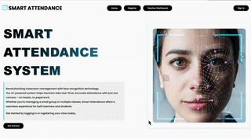

##Smart Attend - Face Recognition Attendence System
This project allows teachers to register students and take attendance using facial recognition.
---

## Features
-  Webcam registration
-  Teacher dashboard with live logs
-  Search students by date
-  Face recognition for login
---

##Demo

---

## Technology Used

- Python – Main backend programming language
- Flask – Web framework for building the app
- SQLite – Lightweight database for storing user and login data
- SQLAlchemy– ORM to interact with the database
- OpenCV – For image processing and handling webcam/photo input
- face_recognition – Facial recognition library built on dlib
- HTML/CSS – Frontend structure and design
- javaScript– For webcam access and image capture on frontend

---
